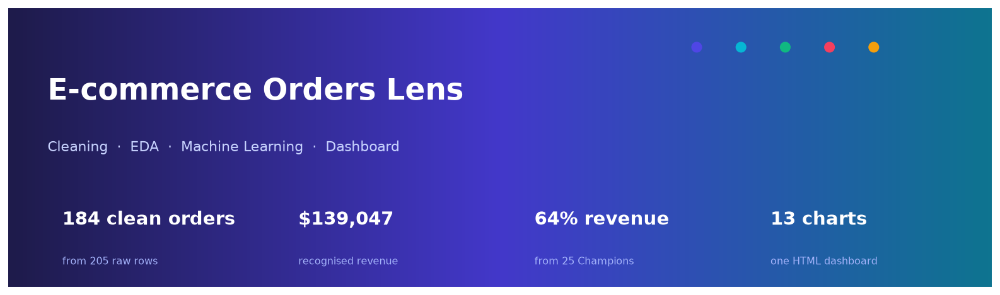
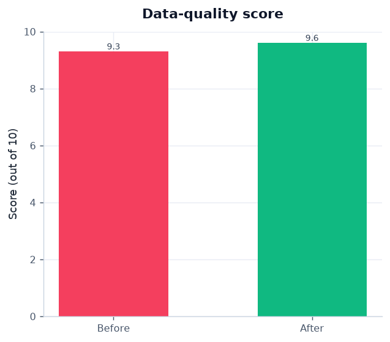
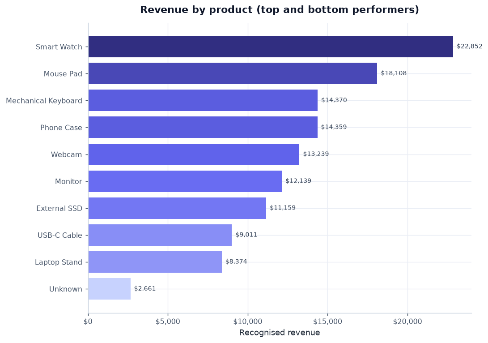
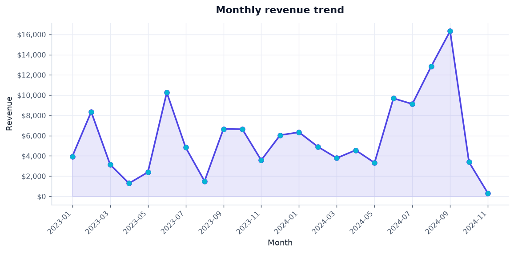
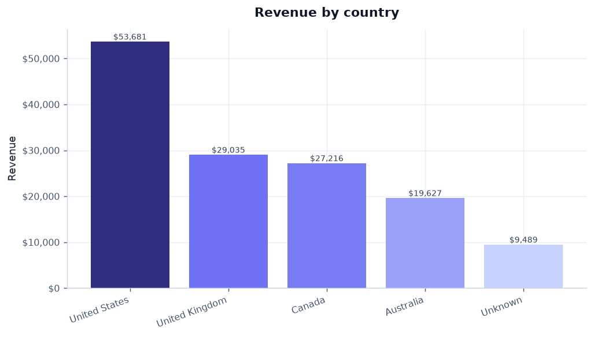
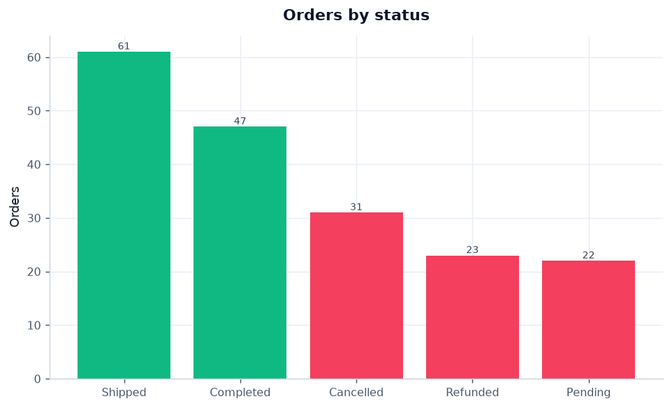
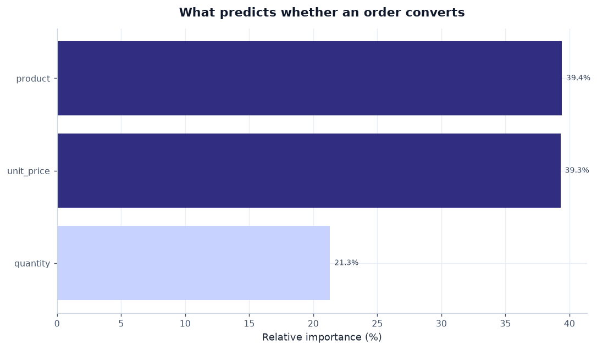
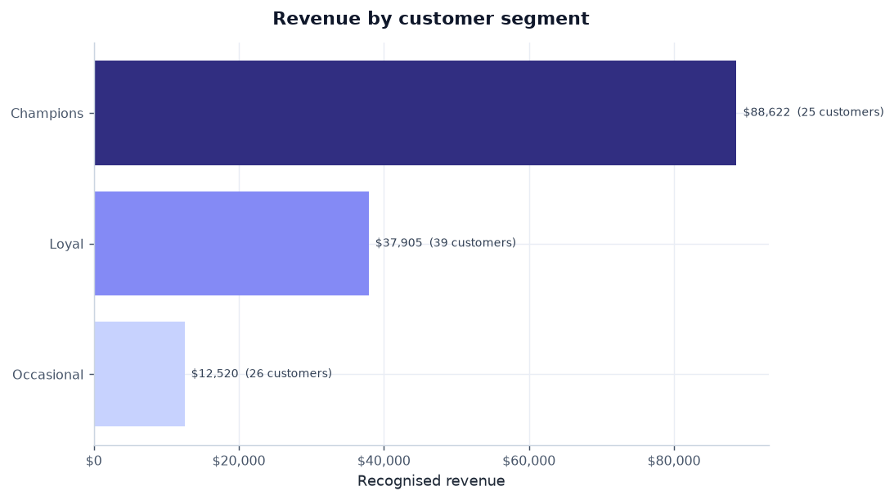

# E-commerce Orders Lens

A synthetic e-commerce orders dataset, taken end to end: a documented
**21-step cleaning pipeline**, **question-by-question Python EDA**, **two
machine-learning algorithms**, and a **self-contained HTML dashboard** — all
rendered in one consistent **Indigo Aurora** colour theme.

<p align="center">
  
</p>

<p align="center">
  <a href="https://github.com/panteamkhh/ecommerce-orders-lens/actions/workflows/ci.yml"></a>
  
  
  
  
</p>

## Table of contents

- [Dataset](#dataset)
- [Colour theme — Indigo Aurora](#colour-theme--indigo-aurora)
- [Part 1 — Cleaning and exploring in Python](#part-1--cleaning-and-exploring-in-python)
- [Part 2 — Machine learning](#part-2--machine-learning)
- [Part 3 — The dashboard](#part-3--the-dashboard)
- [Key results](#key-results)
- [Tech stack](#tech-stack)
- [Project structure](#project-structure)
- [Quick start](#quick-start)
- [Development](#development)
- [Key assumptions](#key-assumptions)
- [License](#license)

## Dataset

`data/Ecommerce_Orders.csv` is a **synthetic sample** order file used for
demonstration. It ships with deliberate, realistic defects so the cleaning work
is meaningful:

- **205 rows, 12 columns** — one row per order line.
- Missing identifiers, blank rows and exact duplicates.
- Mixed casing and abbreviations in `status`, `country`, `payment_method`.
- Two date formats mixed together (`M/D/YY` and `D-M-YYYY`).
- Currency symbols embedded in `unit_price` (`$385 `).
- Impossible values (`quantity` of `0` and `-1`) and totals that do not match
  `quantity * unit_price`.

| Column | Type | Notes |
| --- | --- | --- |
| `order_id` | text | business key, format `ORD-#####` |
| `customer_name` | text | sometimes `Last, First`, mixed casing |
| `email` | text | mixed case, some invalid addresses |
| `order_date` | date | two source formats |
| `product` | category | 11 products (incl. `Unknown`) |
| `quantity` | integer | positive whole number |
| `unit_price` | money | may carry `$` and spaces |
| `total_price` | money | should equal `quantity * unit_price` |
| `status` | category | Completed / Shipped / Pending / Cancelled / Refunded |
| `country` | category | canonicalised to 5 values |
| `payment_method` | category | Card / PayPal / Apple Pay |
| `notes` | free text | `gift wrap`, `rush order`, placeholders |

> Emails are illustrative placeholders, not real people. Treat them as dummy data.

## Colour theme — Indigo Aurora

Every chart is rendered from one palette, so the whole gallery reads as a set
rather than a pile of unrelated images. The rules are simple:

| Role | Colour |
| --- | --- |
| Magnitude (gradient light → deep) | `#c7d2fe` → `#6366f1` → `#312e81` |
| Signature lines & accents | `#4f46e5` indigo · `#06b6d4` cyan |
| Revenue-positive signals | `#10b981` emerald |
| Losses / cancellations | `#f43f5e` rose |

Magnitude alone is encoded by colour intensity — the darkest bar is always the
biggest. Semantic colours (green = realised, rose = lost) are reserved for
status and data quality so meaning is never ambiguous.

## Part 1 — Cleaning and exploring in Python

The analysis starts with one question and lets each answer point to the next.
Every number below comes from a function in [`src/`](src), so the notebook, the
CLI report and the dashboard can never drift apart.

**First, clean without guessing.** The raw CSV is read entirely as *text* so
pandas cannot hide problems by "helpfully" coercing types. The 21-step checklist
then runs in seven phases — structural cleaning, standardizing, validating,
outliers, categories, integrity, export — and **every action is written to an
audit log** with its reasoning:

```python
raw = data_loader.load_and_validate()          # 205 x 12, all text
clean, log, metrics = data_cleaning.clean_orders(raw)
# -> 184 x 13, quality score 9.3/10 -> 9.6/10, 29 documented actions
```

<p align="center">
  
</p>

**Which products actually drive the business?** Ranking products by recognised
revenue shows a healthy spread — but the bottom of the list is dominated by
accessories that barely move the needle.

<p align="center">
  
</p>

**Is revenue steady, or seasonal?** Rolling revenue up by month reveals clear
peaks and troughs across the two years on file.

<p align="center">
  
</p>

**Where is the revenue coming from?** Aggregating by country shows one market
generating over a third of all revenue, with a long tail behind it.

<p align="center">
  
</p>

**Does the money actually arrive?** Only **59%** of orders are in a
revenue-recognised status. The rest is trapped in cancellations, refunds and
pending orders — a useful early-warning signal.

<p align="center">
  
</p>

Every chart above is produced by [`src/visualization.py`](src/visualization.py);
the numbers behind it by [`src/analysis.py`](src/analysis.py). Run the whole
thing with one command and the notebook re-executes end-to-end on fresh data
with no manual steps.

## Part 2 — Machine learning

Two algorithms run on the cleaned table, both in [`src/ml.py`](src/ml.py) with a
fixed random seed so every run reproduces the same numbers.

**Algorithm 1 — will this order convert?** A binary classifier predicts
`is_revenue` (Completed / Shipped) from order attributes: `quantity`,
`unit_price` and `product`. It compares a naive **baseline**, **logistic
regression** and a **random forest** under 5-fold stratified cross-validation,
then scores the winner on a held-out test set. Reporting the baseline matters —
on this synthetic data the model lands at **AUC ≈ 0.48 vs a 0.50 baseline**,
i.e. order outcome is *not* predictable from order attributes alone. That null
result is a finding in itself: cancellations here are operational, not a
function of what was ordered.

<p align="center">
  
</p>

**Algorithm 2 — who are the customers?** Unsupervised **KMeans over RFM**
(Recency, Frequency, Monetary value), with the number of clusters chosen by
**silhouette score** rather than by hand. It finds three clean, actionable
segments:

<p align="center">
  
</p>

| Segment | Customers | Avg. recency | Avg. frequency | Revenue share |
| --- | --- | --- | --- | --- |
| Champions | 25 | 164 days | 3.4 orders | **63.7%** |
| Loyal | 39 | 119 days | 1.8 orders | 27.3% |
| Occasional | 26 | 459 days | 1.1 orders | 9.0% |

A quarter of customers generate nearly two-thirds of revenue — the clearest
targeting signal in the dataset.

## Part 3 — The dashboard

The Python notebook answers each question once. The dashboard makes the same
questions browsable: headline KPIs, every chart (including the ML ones), and the
supporting tables on a single page.

**A single self-contained file.** `reports/dashboard.html` embeds every chart as
a base64 PNG, so it opens offline in any browser, can be emailed, and needs no
server or extra dependency. It includes:

- **8 KPI cards** — orders, recognised orders, revenue, AOV, units, completion
  rate, customers, products.
- **13 charts** — products, trend, geography, payments, status, customers,
  seasonality, cancellation impact, data quality, confusion matrix, feature
  importance, ROC curve and customer segments.
- **7 tables** — product, country, payment, customer, status, segment and
  predictor breakdowns.

## Key results

- **184 clean orders** from 205 raw rows; data-quality score **9.3 → 9.6 / 10**.
- **$139,047** recognised revenue across 108 Completed/Shipped orders.
- Average order value **$1,287**; **574** units sold.
- **Smart Watch** is the top product ($22,852, 16.4% of revenue).
- **United States** leads geography with **38.6%** of revenue; **Credit Card**
  leads payments with **41.0%**.
- **$83,896** of order value sits in **Cancelled / Refunded / Pending** orders —
  the single biggest lever for the business.
- **41%** of orders never convert to recognised revenue.
- **ML (classification):** order outcome is **not** predictable from order
  attributes (CV AUC 0.48 vs 0.50 baseline) — cancellations are operational, not
  driven by *what* was ordered.
- **ML (clustering):** **25 Champion customers (28% of customers) drive 63.7% of
  revenue**; occasional shoppers are the churn risk.

## Tech stack

**Python** — pandas, numpy, matplotlib, seaborn, scikit-learn, Jupyter
**Reporting** — self-contained HTML dashboard (no server)
**Tooling** — pytest, ruff, black, GitHub Actions, pre-commit

## Project structure

```
Ecommerce_Orders/
├── data/
│   └── Ecommerce_Orders.csv          # raw source file
├── src/                              # analysis package
│   ├── config.py                     # paths, category maps, business rules
│   ├── data_loader.py                # reads + validates the raw CSV as text
│   ├── data_cleaning.py              # the 21-step checklist + audit log
│   ├── feature_engineering.py        # calendar + revenue fields
│   ├── analysis.py                   # one function per business question
│   ├── ml.py                         # classifier + KMeans RFM segmentation
│   ├── visualization.py              # Indigo Aurora theme + charts
│   ├── dashboard.py                  # builds reports/dashboard.html
│   └── run_analysis.py               # end-to-end CLI entry point
├── tests/                            # pytest suite (34 tests)
├── notebooks/Ecommerce_Orders_Analysis.ipynb
├── screenshots/                      # hero banner + 13 themed charts (committed)
├── cleaned_data/                     # cleaned CSV/XLSX + audit log (generated)
├── reports/dashboard.html            # self-contained dashboard (generated)
├── reports/ml_metrics.json           # model metrics (generated)
├── pyproject.toml                    # metadata, deps, tool config
├── requirements.txt                  # runtime dependencies
├── requirements-dev.txt              # runtime + dev dependencies
└── .github/workflows/ci.yml          # lint + test + run CI
```

## Quick start

```bash
# from the project folder
python -m venv .venv
# Windows (PowerShell)
.\.venv\Scripts\Activate.ps1
# macOS / Linux
source .venv/bin/activate

pip install -r requirements.txt

# run the full pipeline: clean -> analyse -> ML -> charts -> dashboard
python -m src.run_analysis
```

Outputs:

- `cleaned_data/Ecommerce_Orders_cleaned.csv` and `.xlsx` (with a
  **Cleaning_Log** sheet)
- `screenshots/*.png` — the hero banner and 13 themed charts
- `reports/dashboard.html` — open it in any browser
- `reports/ml_metrics.json` — cross-validation and test metrics

Or explore interactively:

```bash
pip install -r requirements-dev.txt
jupyter notebook notebooks/Ecommerce_Orders_Analysis.ipynb
```

## Development

```bash
pip install -e ".[dev]"     # or: pip install -r requirements-dev.txt

ruff check .                # lint
black --check .             # formatting
pytest                      # tests
pre-commit install          # optional git hooks
```

CI runs lint, format checks, the test suite and a full pipeline run on Python
3.10–3.12. See [`CONTRIBUTING.md`](CONTRIBUTING.md) for details.

Convenience targets are available through the `Makefile` (`make run`, `make test`,
`make lint`, `make format`). Every model and chart uses `config.RANDOM_STATE`, so
runs are reproducible: `python -m src.run_analysis` produces identical numbers
and charts on every execution.

## Key assumptions

- **Recognised revenue** counts only `Completed` and `Shipped` orders;
  `Cancelled`, `Refunded` and `Pending` are excluded from revenue but retained
  for impact analysis.
- **`total_price` is recomputed** as `quantity * unit_price` where both source
  measures exist, because the source totals disagree far more often than the
  inputs do.
- **Missing categories** become an explicit `Unknown` rather than being dropped,
  so rows stay usable; a missing `order_id` is the only value that forces a row
  out.
- **Outliers are flagged, not deleted** — a single high-value order may be the
  exact signal the business cares about.
- **ML models are deliberately small** — the dataset has under 200 rows, so a
  regularised logistic regression and a shallow random forest are compared
  against a naive baseline; a model that cannot beat the baseline is reported as
  such rather than tuned into overfitting.
- The dataset is **synthetic**; no real customer data is present.

## License

Released under the [MIT License](LICENSE).
